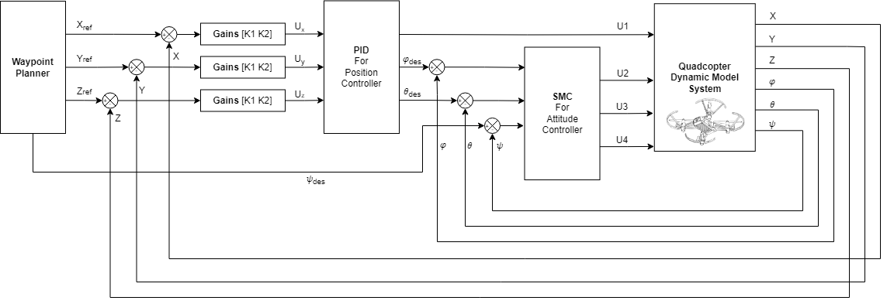

# Quadcopter Python 3D Plot Animation
A Quadcopter simulation with 3D Plot Animation using matplotlib python package.  It contains a basic quadcopter dynamics model, hover controller, waypoint position control, and visualisation toolkit using matplotlib animation.

<p align="center">
  
</p>

## Motivation
This project is my undergraduate thesis project about how to control a quadcopter using an Integrated Sliding Mode Control. This project serve me with two purpose: that is as a learning module how to build a model to explain how Quadcopter behave and as a ground level for tuning my parameters to control the Quadcopter. For me, there are already many interesting projects around already, like vision-based SLAM, hover control and advance maneuver, etc. However, there are very few open-source quadcopter simulator that helps a beginner(possibly me) to overcome the mental barrier of understanding the underlying physics behind the model of the Quadcopter and a simple plot animation for visualizing this simulation for easy debugging. This project is a simple Quadcopter simulation in 3D Plot Animation, where I was heavily inspired by this code structure from [SKYnSPACE](https://github.com/SKYnSPACE/AE450/tree/master/Lec10). I hope this helps for anyone to learn how Quadcopter works

## How to Run
Clone the repository, move into the directory, and run the code:
```sh
$ git clone https://github.com/WallNutss/EE234899-Python-Quadcopter-Simulation.git
$ cd EE234899-Python-Quadcopter-Simulation
$ python run3DSimulation.py
```

## What you can change

    ├── run3DSimulation.py     # main file to run, it contains the Quadcopter Class representation for dynamics update
    ├── lib                    # support files where it contains the controller, rotation matrix, quadcopter parameters class
    ├── windModel              # Code for Wind Model based on Dryden Wind Turbulence Model
    └── README.md
    
In this simulation, I use a common cascade controller which is the first one is the position controller using a PID Controller and the second one is an attitude controller where I have two types of this controller. Which is using a PID Controller and five modifications of SMC Controller, namely SMC-Sign, SMC-Saturation, SMC-Tanh, and Integral SMC-Tanh. The files and folder structure listen above. If you find any error or bug please let me know.

So it the `run3DSimulation.py`, it's the main file you want to run, where you can find the class variable Quadcopter. Here I have provided a simple change parameter you can use
* Ts(Time Sampling) : Used to define how fast the simulation runs. Value of in format of seconds. Default to 0.02s. Used to define how fast the simulator runs.
* controller : a decision variable, use 0 for choosing PID as an attitude controller and 1 for SMC Controller
* smctype : a decision variable, there are 5 mode for this, feel free to choose them, details in file `lib\controller` SMC function
* DISTURBANCE : Set `True` to apply wind disturbance to simulation

in `lib`, there is little you can change, but hey feel free to break it. Where in `windModel` it contains the Dryden Wind Turbulence Model. You can change the possible height of the Quadcopter is flying for better simulation prediction.

## System Control Structure

<p align="center">
  
</p>

First off, I used the template of common cascade controller and for the calculation of the simulation I just some simple Euler Integration Method for accessing the observable variables that we need such as the velocity of the object and the angles of that time point in the simulation. In this simulation, for the simulate the quadcopter move I don't include a motor model, but directly push thrust into the dynamcis quadcopter model. I just the motor parameters(in this case I use DJI Tello), to calculate the upper-lower bound limit of the Quadcopter can have. The current parameters are set to roughly match the characteristics of a DJI Tello that I have in my lab. You can see this calculation reference [here](https://wilselby.com/research/arducopter/controller-design).

### Simulation
in `lib\quadcopter.py` , I've defined a Quadcopter Class and its methods are relatively simple : initialize the quadcopter with various parameters and initial conditions, update the states, calculate the state derivatives, and calculate other useful information. The simulation uses a euler angles in the state vector to express the drone's rotation, and the state derivative vector is calculated in hard code using Euler Integration Method. 

### Control
In this simulation, as I spoken before I divided the controller to Position Controller and Attitude Controller. The position controller responsible for making the neccessary calculation how to move the quadcopter to the desired location where the attitude controller responsible to uphold the control that the position controller want how much it needs. The Position controller use a PID Controller and Attitude controller I have put two controller, which is PID and Sliding Mode Controller. For it's derivation on how I manage to get those model calculation, you can checkout this paper. There are future plans to add more ways of controlling the quadcopter.

## Known Issues
* When we set Time sampling  beyond 0.1s, It breaks. My predictions is that because I update my state through euler derivation method it become messed up where I use time sampling as my derivative calculation.
* This is from me as incapable slave :). Inconsistent the use of Quadcopter models inside the position controller for conversion from position error to desired angles where it was used in attitude controller. I'm still indecisive for this application. Feel free to raise the issue or contact me if you have brilliant idea regarding the dynamics. I'm stuck

## Possible Development
* Sensor Emulation in the Simulation add a filter for that like Kalman Filter. I see some possible integration like [this](https://openimu.readthedocs.io/en/latest/simulation.html), but hey you can try it or maybe if I have the will to comeback and update this. Because right now, the state variables are being supplied directly from the model (In my opinion is a bit cheating)
* Better dynamics model update calculation, I see some people using package like Scipy and etc
* Matplotlib Animation alternative, Since Matplotlib only uses CPU to compute the drawing, sometimes its draining resources. Or just optimize the code for better readibility. (But Hey better than Matlab 😌)
* A Trajectory Generator, I have succeed making it move to multiple waypoints through timing decision, but it's better to have an algorithm to it automatically to follow a series of waypoints.
* Implement some other controller, I prefer model-free controller. Like Reinforment Learning
* Implement an obstacle avoidance algorithm such as Artificial Potential Field etc
* Develop automatic method to find optimal gains for best response. I hate parameter tuning

## Gif Gallery
<p align="center">
  
  
  
</p>

## Contact
Muhammad Juniarto
Email: wallnuts73@gmail.com

